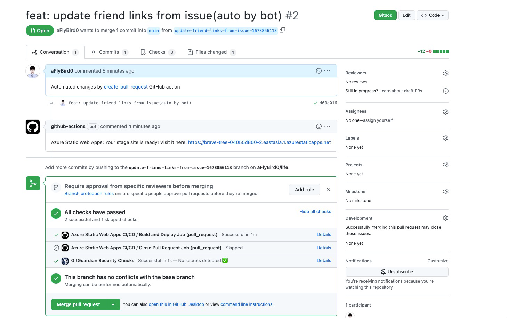
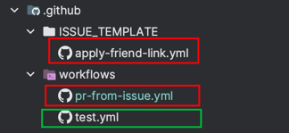

# blog-friends

主要为 https://blog.aflybird.cn/ 提供自动化的友链申请。如果你也想用这个自动化的友链申请，可以参考下面的使用方法/高度自定义。

## 1 效果

1. 自动生成友链申请的 Issue 模板

2. 模板内容如下。

其中**分组**是可以自定义的，会检测当前博客中是否有这个分组，如果没有就会在友链页面末尾添加一个新的分组；如果已经有了，就会查找当前分组的位置，把新的友链添加到这个分组已有的友链列表的末尾。

_本项目假定友链页面下的每个分组都是以 `# 分组名` 开头的，如果你的友链页面不是这样的，可以参照下文的「3 高度自定义」部分。

3. 有人提交申请后，会自动向博客仓库发起 PR（这里贴图主要是为了展示能自动生成 PR，但 PR 下面的那些自动生成网站预览等功能是 azure 的功能，和本项目无关）

4. 检查一下友链提交的内容，没问题就合并 PR，合并后会自动更新友链页面（如果你的博客配了 CI/CD 的话）

## 2 使用方法

> 前置条件：拥有自己的博客，代码放在 GitHub 上（不需要公开），使用 Hugo 搭建，最好是 LoveIt 主题。 
> 参考这篇文章给博客加上友链页面：[Hugo系列(3.0) - LoveIt主题美化与博客功能增强 · 第一章-添加友链页面](https://lewky.cn/posts/hugo-3.html/#%E6%B7%BB%E5%8A%A0%E5%8F%8B%E9%93%BE%E9%A1%B5%E9%9D%A2)

第一步的步骤是通用的：

1. 在浏览器访问本[仓库](https://github.com/aFlyBird0/blog-friends)，点仓库旁边的 `Use this template` 按钮，新建并复制我这个仓库。主要目的是，友链申请表单和友链页面结构每个人可能都不一样，复制一份自己的既是方便修改，也不会因为我后面修改这个仓库而影响到你的博客。
   

> 假定你的 GitHub ID 是 `user-abc`，博客仓库是 `blog`，假设刚刚创建的仓库名是 `blog-friends`。

后面的操作就看情况而定了：

### 2.1 如果自己的博客仓库是 Public 的，且想把博客仓库直接作为友链仓库

1. （参照前面说的把这个仓库用 Template 复制一份到自己的 GitHub 账号下）
2. 拆分文件：`user-abc/blog-friends` 的 `.github` 文件夹中一共有三个子文件，如下，我们把红框内的文件**剪切到**到 `user-abc/blog` 仓库中，目录结构保持一致。（这样 `user-abc/blog-friends` 下就只剩下 `.github/workflows/test.yml` 这个文件了）

3. 修改 `.github/ISSUE_TEMPLATE/apply-friend-link.yml` 文件，修改第2行的 `description` ，把第6行的 GitHub ID 改成 `user-abc`
4. 修改 `.github/workflows/pr-from-issue.yml` 文件。把第7行的 `FRIEND_TOOL_REPO: aFlyBird0/blog-friends` 改成 `FRIEND_TOOL_REPO: user-abc/blog-friends`；第8行的 `BLOG_REPO: ${{ secrets.BLOG_REPO }}` 改成 `BLOG_REPO: user-abc/blog`
5. 注释掉 `.github/workflows/pr-from-issue.yml` 文件的第 16 行，反注释第 19 行。（也就是选择第二个 TOKEN 配置方式，详见 yml 注释）
6. 把 `user-abc/blog` 和 `user-abc/blog-friends` 更新的代码提交了（push）

### 2.2 如果自己的博客仓库是 Private 的；或者想把友链申请仓库和博客仓库分开（像我这样）

1. （参照前面说的把这个仓库用 Template 复制一份到自己的 GitHub 账号下）
2. 修改 `.github/ISSUE_TEMPLATE/apply-friend-link.yml` 文件，修改第2行的 `description` ，把第6行的 GitHub ID 改成 `user-abc`
3. 修改 `.github/workflows/pr-from-issue.yml` 文件。把第7行的 `FRIEND_TOOL_REPO: aFlyBird0/blog-friends` 改成 `FRIEND_TOOL_REPO: user-abc/blog-friends`；第8行的 `BLOG_REPO: ${{ secrets.BLOG_REPO }}` 改成 `BLOG_REPO: user-abc/blog`
4. 申请一个 [GitHub Personal Access Token](https://docs.github.com/en/authentication/keeping-your-account-and-data-secure/creating-a-personal-access-token)，全选 `repo` 权限。然后把 token 添加到仓库的 Settings->Secrets and variables->Actions 中，名字为 `GH_PAT` （别把反引号也复制过去了）
5. 把`user-abc/blog-friends` 更新的代码提交了（push）

## 3 高度自定义（如Issue模板、友链页面结构）

> 先按 「2 使用说明」，选择 2.1 或 2.2 方式，跑通流程。

后面就是改表单/代码了：

* 其中表单的内容是在 `apply-friend-link.yml` 文件中修改的，可以参考 [GitHub Issue Form](https://docs.github.com/en/communities/using-templates-to-encourage-useful-issues-and-pull-requests/syntax-for-issue-forms) 的文档。
* 如果想要修改友链页面的结构，需要修改 `combine.go` 的第18和34行。比如如果你的友链分组是二级标题，那么就把 `#` 改成 `##`；如果你的友链分组是二级标题，并且把分组名用 `【】` 括起来了，就把18行的`"# %s\n"`改成`"## 【%s】\n"`，把34行的`"\n# "`改成`"\n## "`。
* 如果只改了表单部分字段的标题（label），（即没有更改表单字段的位置/数量）需要同步修改 `extract.go` 的第11行。（有个正则，应该一下子就能看懂，照着改就行）
* 如果连表单字段的位置/数量都改了，除了要修改 `extract.go` ，还要改一下 `generate.go` 中的 `Generate` 函数，主要是修改元素下标、变量名等。
* 提交代码（视前置步骤不同，可能有1-2个仓库，都要提交）。项目的关键函数配有单元测试，改了代码/表单后，可以修改相应测试用例。运行测试用例有两种方法，一种是在本地装 Go 环境，然后运行 `go test ./...`，另一种是在 GitHub 上提交代码，然后在 Actions 中查看测试结果。（哦对，还有个golangci-lint，这个需要在[本地](https://golangci-lint.run/usage/install/)安装一下，然后在项目根目录运行 `golangci-lint run ./...`。如果嫌麻烦，也可以把 `.github/workflows/test.yml` 文件中的 `golangci-lint` 部分注释掉）

